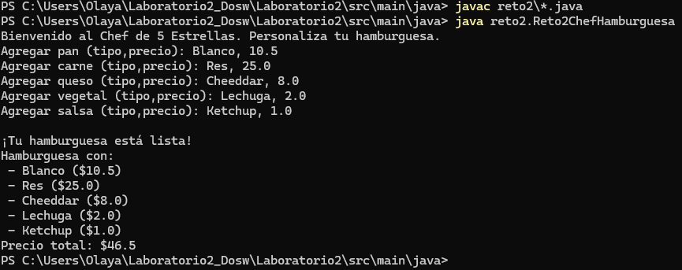

### TOMAS OLAYA DIAZ
### SAMUEL FELIPE CASTELBLANCO 

# Reto #2: El Chef de 5 Estrellas

## Diseño y Patrón de Diseño Utilizado

### ¿Por qué elegimos el patrón Builder?

Quisimos usar el patrón Builder porque nos permite crear un objeto complejo —en este caso, una hamburguesa personalizada— paso a paso. Esto facilita que cada ingrediente se pueda agregar de forma flexible y clara, este patrón separa la construcción de la hamburguesa de su representación final, lo que hace que el código sea más limpio, fácil de mantener y ampliar en el futuro.

### ¿De qué trata el proyecto?

El proyecto simula a un chef que prepara hamburguesas totalmente personalizadas para sus clientes. Cada hamburguesa puede tener pan, carne, queso, vegetales y salsas. El usuario puede elegir el tipo y el precio de cada ingrediente, y el sistema calcula  el costo total usando streams para sumar los precios.

### Diseño propuesto

- **Ingrediente**: representa cada ingrediente con su nombre y precio.  
- **Hamburguesa**: contiene las listas de ingredientes y tiene métodos para mostrar la hamburguesa completa.  
- **HamburguesaBuilder**: se encarga de construir la hamburguesa paso a paso, agregando ingredientes según lo que el usuario elija.  
- **Reto2ChefHamburguesa**: clase principal que interactúa con el usuario para personalizar y crear la hamburguesa.

---

Este diseño permite una construcción modular y flexible, y hace que la personalización sea sencilla y amigable para el usuario.

