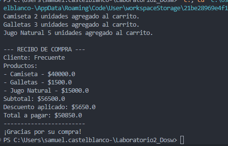

### TOMAS OLAYA DIAZ
### SAMUEL FELIPE CASTELBLANCO 

# Reto #1: El problema de la tienda de Don Pepe

## Diseño y Patrón de Diseño Utilizado
* Stratergy

### ¿Por qué elegimos el patrón Sratergy?

Elegimos el patrón Strategy porque la lógica de negocio de Don Pepe requiere aplicar diferentes algoritmos de descuento (5% para nuevos, 10% para frecuentes) sobre un mismo proceso de venta.

### ¿De qué trata el proyecto?

Este proyecto consiste en el desarrollo de un Sistema de Gestión de Ventas Inteligente diseñado específicamente para resolver un problema de descontrol financiero en un negocio minorista.

---

Este diseño permite una construcción modular y flexible, y hace que la personalización sea sencilla y amigable para el usuario.

